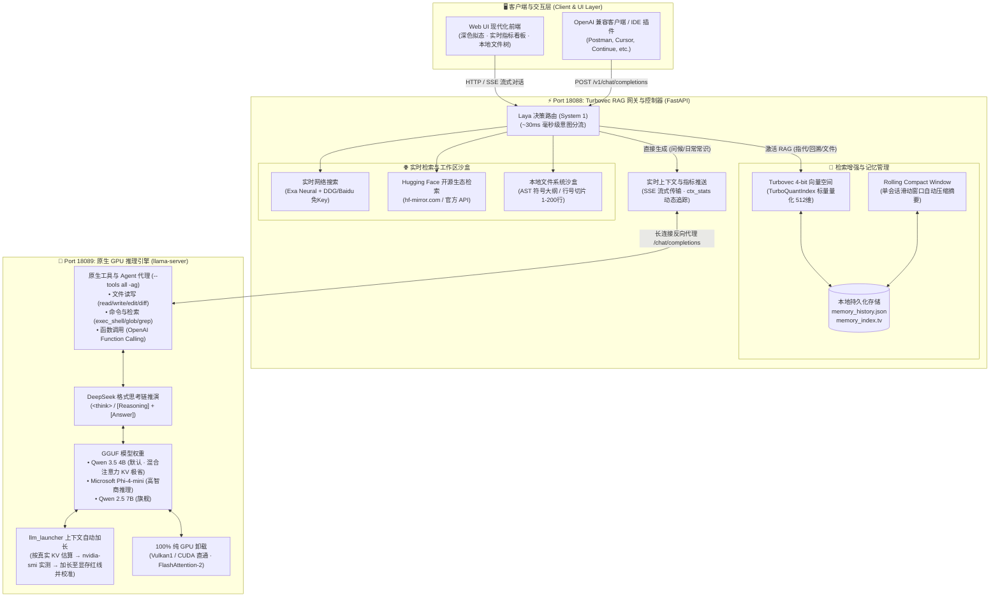

# Local_WorkSpace · Turbovec RAG 本地智能工作区与多模型对话系统

> **Windows 原生运行 · 摆脱 Docker 虚拟化**

基于 **Qwen 3.5 / Phi-4 / Qwen 2.5 原生大模型(可更换为更强大的模型**、**Turbovec 4-bit 标量量化向量空间**、**Laya 极速意图路由器** 的全功能本地知识库、代码工作区与长期记忆系统。

> [!IMPORTANT]
> **📌 会话机制特别说明 (Chat Session Note)**  
> **本项目目前尚未实现多会话（Different Chats）管理与自由切换功能，全部对话交互均维持在同一个统一的持久化主会话（Single Continuous Chat）中。**  
> 系统依靠「Rolling Compact Window 滑动窗口自动摘要压缩（超出 8 轮自动提炼早期轮次）」与「Turbovec 4-bit 长期标量量化向量记忆库」协同机制，保证在单一会话持续演进时历史上下文不会撑爆显存。如需开启全新话题，可在 Web 界面点击「清空上下文」一键重置当前轮次。

---

## 🏛️ 系统架构设计 (System Architecture)

系统采用双独立原生进程解耦架构：**Port 18088** 作为统一对外网关与 RAG 控制中枢，**Port 18089** 作为专有 GPU 本地推理引擎，并通过底层原生管道实现低延迟、零内存拷问与全功能协同。



---

## 🌟 核心技术亮点与特性 (Key Features)

### 1. 100% 纯原生运行（完全脱离 Docker 虚拟化）
* **零虚拟化损耗**：不需要启动 Docker Desktop、不需要 WSL2 虚拟环境，直接由 Windows 原生进程调度 NVIDIA GPU，消除全部虚拟化开销。
* **双独立端口收敛**：
  * **Port 18088**：统一对外服务入口（Web 界面、RAG 向量检索、本地文件沙盒、OpenAI 兼容 API 网关，入口文件：`app/main.py`）。
  * **Port 18089**：专有 GPU 推理端点（纯净高性能 `com.docker.llama-server.exe` 引擎，启动器：`run_local_llm.ps1`）。

### 2. 原生引擎全量 Tools & Agent 体系 (Port 18089)
* **参数级深度集成**：底层推理引擎全面注入 `--tools all -ag` 选项，开启原生工具调用协议与 CORS 代理。
* **内置工具集 (Built-in Tools)**：支持自主文件操作（`read_file`, `write_file`, `edit_file`, `apply_diff`）、本地全盘与正则检索（`file_glob_search`, `grep_search`）、系统命令执行（`exec_shell_command`）与时间感知（`get_datetime`）。
* **OpenAI 兼容 Function Calling**：网关层与引擎层 100% 透传 `tools` 与 `tool_choice` 参数，支持流式 SSE 分块解析工具调用（`tool_calls`）并实时上报上下文状态。

### 3. 原生两段式深度推理与思考链 (Reasoning Protocol)
* **协议化思维推演**：引擎开启 `--reasoning on --reasoning-format deepseek`，全面支持 `<think>` 标签思维链流式输出。
* **双段式结构规约 ([Reasoning Protocol])**：
  * **`[Reasoning]`**：严格使用纯英文 (English) 进行 3-5 点精炼逻辑推导、几何与物理空间约束验证，消除直觉式幻觉。
  * **`[Answer]`**：给出逻辑严密、条理清晰的正式解答，语言自然跟随用户输入提问。
* **实时上下文统计监控 (Context Stats)**：SSE 响应流实时动态下发 `ctx_stats` 结构，精确追踪 `prompt_tokens`、`reasoning_tokens`、`content_tokens` 与总上下文负荷，并在前端侧边栏仪表盘与微光动效胶囊中动态渲染。

### 4. 上下文自动加长至显存红线 (Auto Context Expansion · `app/llm_launcher.py`)
* **为什么运行中显存是固定的**：llama-server 启动时按 `-c` 一次性预分配全部 KV cache 与计算缓冲，之后不随对话长度变化。所以“显存不到红线就继续加上下文”只能在**启动时**决定 `-c`。
* **红线**：`总显存 − vram_reserve_mb`（默认 204MB，4GB 卡 ≈ 3.8 GiB），在 `llm_models.json` 中可调。
* **流程**：
  1. 按真实结构计算 KV 占用：`kv_layers × kv_heads × head_dim × (K + V 字节)`。K=q8_0 / V=q4_0 时：Qwen 3.5 4B **13.0**（32 层中仅 8 层 full attention）、Phi-4-mini **52.0**、Qwen 2.5 7B **22.75** MiB / 1k tokens。
  2. 用 `红线 − 其他程序已用显存 − 模型开销` 规划 `-c`，启动。
  3. 启动后 `nvidia-smi` 实测；离红线还有 ≥2k tokens 余量就**加长并重启一次**，超过红线就**缩小**；启动失败自动减半重试。
  4. 实测的非 KV 开销写入 `app/storage/ctx_calibration.json`，下次启动一次命中。
* **单一配置**：`llm_models.json` 同时供 `run_local_llm.ps1` 与网页热切换 (`/api/model`) 使用。
* **KV 缓存量化**：保持 `Key=Q8_0, Value=Q4_0`（同类型 q8/q8 或 q5 可在配置中修改，但 q5 在部分后端的 FlashAttention 会回退 CPU）。

### 5. 双脑分层路由 (System 1 快思考 + System 2 慢推理)
* **System 1 (Laya 决策模型 / BGE 语义路由)**：前置路由耗时仅 **~30ms**。对日常问候、独立创作、泛知识问答直接跳过向量检索秒级生成；仅在检测到指代词、历史回溯、代码文档查询时激活向量检索。
* **System 2 (原生大模型深度推理)**：结合上下文与精准记忆切片，进行复杂几何、空间、逻辑分析与深度工程推演。

### 6. 单会话机制与分层记忆管理 (Single Chat & Tiered Memory)
* **单会话机制**：目前系统专注于极致的单会话智能体交互，**暂未实现不同会话（Multiple Chats）的分支切换功能，全部对话统一维持在单一主会话中**。
* **短期滑动窗口压缩 (Compact Window Memory)**：会话超出 8 轮时自动将早期轮次提炼为压缩摘要，避免长历史撑爆显存上下文。
* **长期量化向量库**：采用 **Turbovec 4-bit 标量量化**，将 512 维向量高保真压缩 80% 以上，持久化保存于 `app/storage/` 目录。
* **知识图谱记忆 (KG Memory)**：后台空闲时从对话与文档中抽取三元组实体，提供实体关联浏览与 Graph RAG 融合检索。

### 7. 本地文件系统浏览器与免上传挂载 (Zero-Copy Mount)
* 输入栏新增 **📂 本地** 快捷按钮，支持可视化树状浏览本地工作区。
* **安全白名单沙盒**：默认只允许桌面、文档、下载与项目目录（`ALLOWED_LOCAL_DIRS=路径1;路径2` 追加，`TV_ALLOW_ALL_DRIVES=1` 开放整盘）；realpath + commonpath 校验，拦截 `../`、符号链接/Junction、ADS 与结尾点；写回禁止改写服务自身代码、`.git`、根目录启动脚本与 `llm_models.json`。
* **智能切片与符号大纲**：支持代码 AST 符号大纲提取（Python, JS/TS, C/C++, Java, Go, Rust 等），并支持任意行号精确切片提取（如 `1-200行` 真实源码逐行输出）。

---

### 8. Web IDE (`/ide` · 仿 Cursor)
* 聊天页右上角「⌨ IDE」进入：资源管理器、多标签编辑器 (CodeMirror 6)、全文搜索、Ctrl+P 快速打开、底部真终端 (xterm.js + pywinpty)、Git 源代码管理（暂存/提交/历史/回滚/分支/push/pull）、右侧 AI 对话可「应用到编辑器」。
* 低资源：前端库离线打包 (~1.3MB)，JS 堆约 6–10MB；最多 3 个终端、12 个标签。
* 快捷键：`Ctrl+S` 保存 · `Ctrl+P` 快速打开 · `` Ctrl+` `` 终端 · `Ctrl+Shift+E/F/G` 资源管理器/搜索/Git · `Ctrl+L` AI 面板。
* 接口约定见 `docs/IDE_API.md`。Windows 终端需 `pip install pywinpty`，Git 需 `git.exe` 在 PATH。

---

## 📁 项目目录结构 (Directory Structure)

```
Local_WorkSpace/
├── app/
│   ├── main.py                  # FastAPI 主服务、Turbovec 索引、Laya 路由、Tools 透传与热重载管理
│   ├── embedding_backend.py     # Embedding 后端：ONNX Runtime fp32 (默认) / torch；一次性 ONNX 导出与 --check
│   ├── llm_launcher.py          # llama-server 启动器：上下文自动加长至显存红线 + 实测校准
│   ├── ide_api.py               # Web IDE 后端：文件 / 搜索 / Git / 终端 WebSocket
│   ├── ide_ai.py                # Web IDE 侧边栏 AI 对话与代码修改应用服务
│   ├── agent/                   # Agent 执行引擎、内置工具集、MCP 客户端与技能系统
│   ├── kg/                      # 知识图谱 (Knowledge Graph) 抽取、存储与混合检索
│   ├── static/
│   │   ├── index.html           # 现代化深色拟态 Web UI (集成实时上下文监控卡片)
│   │   ├── app.js               # 流式传输、性能指标、实时上下文统计 (ctx_stats)、本地文件浏览器
│   │   ├── style.css            # 响应式交互样式、微光动效与监控脉冲特效
│   │   ├── ide.html / .js / .css# Web IDE 前端界面与代码编辑逻辑
│   │   └── vendor/              # 离线打包的 CodeMirror 6 与 xterm.js 资源
│   ├── models/                  # 本地离线模型放置目录 (bge-small-zh-v1.5, laya-typed-decisions)
│   └── storage/                 # 持久化存储目录 (记忆历史、向量索引与运行时状态)
├── docs/                        # 开发与接口文档 (AGENT_API.md, IDE_API.md, KG_API.md)
├── scratch/
│   ├── download_model.py        # GGUF 模型断点续传下载工具 (支持官方与 hf-mirror 镜像)
│   ├── download_laya.py         # Laya 决策模型自动下载脚本
│   ├── download_phi4.py         # Phi-4-mini 模型下载工具
│   └── check_system.ps1         # Windows 环境硬件与端口自检诊断脚本
├── llm_models.json              # 模型 / KV 量化 / 显存红线统一配置 (ps1 与网页热切换共用)
├── run_local_llm.bat / .ps1     # 本地原生 GPU 推理启动器 (Port 18089 · 仅本机 · --api-key)
├── run_local_rag.bat / .ps1     # 本地 RAG Web 服务启动器 (Port 18088 · 统一网关与向量检索)
├── start_full_system.bat / .ps1 # 一键全套完整系统联动启动器
├── docker-compose.yml           # 容器化部署编排配置 (可选)
└── README.md                    # 项目文档与系统架构说明
```

---

## 🚀 快捷启动 (Quick Start)

### 选项 A：一键完整联动启动（推荐）
双击运行根目录批处理脚本：
```cmd
start_full_system.bat
```
系统将自动按顺序启动 GPU 推理引擎与 Turbovec RAG 服务，并在浏览器中自动打开：  
👉 **http://localhost:18088**

### 选项 B：分别独立启动组件
* **步骤 1：下载模型权重 (首次运行)**
  ```cmd
  python scratch\download_model.py 4
  ```
  *(可输入 `python scratch\download_model.py` 查看可用模型编号)*

* **步骤 2：启动底层 GPU 推理引擎 (Port 18089)**
  ```cmd
  run_local_llm.bat
  ```
  *(提供 Qwen 3.5 4B、Phi-4-mini 3.8B、Qwen 2.5 7B 交互菜单，全量挂载 `--tools all -ag --reasoning on`)*

* **步骤 3：启动 RAG 知识检索服务与 Web 网关 (Port 18088)**
  ```cmd
  run_local_rag.bat
  ```

---

## 🔌 核心管理与交互 API (REST & Streaming Endpoints)

所有外部交互统一收敛于 **Port 18088**：

| 端点路径 | 请求方法 | 功能说明 | 关键特性 |
| :--- | :--- | :--- | :--- |
| `/api/chat` | `POST` | Web UI 核心对话接口 | 支持 SSE 逐字流式传输、`ctx_stats` 实时上下文监控、`tool_calls` 事件透传、行号切片直接抽取 |
| `/v1/chat/completions` | `POST` | OpenAI 兼容聊天接口 | 零拷贝字节流转发、支持 `tools` 与 `tool_choice` 参数、自动注入 Turbovec 记忆与联网检索切片 |
| `/api/status` | `GET` | 系统运行时状态 | 查询 GPU 显存占用、活跃模型 ID、`server_n_ctx` 上下文上限、挂载文件列表与记忆条数 |
| `/api/model` | `POST` | 动态热切换大模型 | 自动终结旧进程、释放 GPU 显存、重新按显存余量计算最优上下文并拉起新模型 |
| `/api/mcp_settings` | `GET / POST` | MCP 与联网检索设置 | 配置 Exa AI API Key、免 Key 搜索开关、Hugging Face 检索与检索入库规则 |
| `/api/fs/list` | `POST` | 本地文件树浏览 | 安全沙盒白名单校验，返回目录树形结构与文件大小 |
| `/api/fs/read` | `POST` | 本地文件即时预览 | 支持代码高亮大纲、纯文本、PDF (PyMuPDF) 及 DOCX 预览 |
| `/api/fs/mount` | `POST` | 零拷贝工作区挂载 | 将本地文件直接挂入当前工作区并按需向量化索引 |
| `/api/clear` | `POST` | 清空当前对话上下文 | 重置当前会话回合与 Compact 摘要，不影响长期向量记忆 |
| `/api/clear_rag` | `POST` | 重建 Turbovec 向量索引 | 清空持久化向量库与文本历史并重新初始化 4-bit 索引 |

---

## 🛡️ 安全与环境变量 (Security)

| 变量 | 默认 | 说明 |
| :--- | :--- | :--- |
| `TV_HOST` | `127.0.0.1` | 网关监听地址；改成 `0.0.0.0` 开放局域网时**必须**同时设置 `TV_API_TOKEN` |
| `TV_API_TOKEN` | 空 | 非本机请求需带 `Authorization: Bearer <token>` 或 `X-TV-Token` |
| `TV_ALLOWED_ORIGINS` / `TV_ALLOWED_HOSTS` | 空 | 额外信任的网页来源 / Host（默认只信任 localhost / 127.0.0.1） |
| `ALLOWED_LOCAL_DIRS` | 空 | 追加文件浏览白名单目录（`;` 分隔） |
| `TV_ALLOW_ALL_DRIVES` | `0` | `1` = 允许浏览整盘 |
| `TV_LLAMA_API_KEY` | 自动生成 | llama-server `--api-key`；默认存于 `app/storage/llama_api_key.txt`（已 gitignore） |

* llama-server 只监听 `127.0.0.1:18089` 且需 API Key；网关只在访问本机推理引擎时携带密钥。
* 写操作校验 `Origin`（防 CSRF），本机请求校验 `Host`（防 DNS rebinding）；`/api/fetch_url` 拒绝内网 / 回环地址（防 SSRF）。

---

## 🧠 Embedding 后端 (ONNX Runtime)

默认用 **ONNX Runtime fp32** 运行 bge-small-zh-v1.5（`app/embedding_backend.py`），网关进程不再导入 PyTorch。实测：常驻内存 893 MB → 170 MB，单条查询 6.1 ms → 2.1 ms，向量与 torch 一致（cos 1.000000），**已有索引无需重建**。

* **首次启动**：若 `app/models/bge-small-zh-v1.5-onnx/model_fp32.onnx` 不存在，会在独立子进程里用 torch 自动导出一次（约 10–60 秒，日志提示“首次启动：正在把模型导出为 ONNX”），并与 torch 结果逐条校验；之后每次启动直接加载 ONNX（< 1 秒）。导出需要 `torch transformers onnx`（见 requirements 的 optional 段）。
* 手动导出 / 自检（在 `app` 目录下）：`python -m embedding_backend --export models\bge-small-zh-v1.5`、`python -m embedding_backend --check`（打印后端、维度、线程、RSS）。
* 缺少 `onnxruntime` 或导出失败时自动回退 torch 后端并给出修复命令；两者都不可用时启动报错并提示安装命令。

| 变量 | 默认 | 说明 |
| :--- | :--- | :--- |
| `EMBEDDING_BACKEND` | `onnx` | `onnx` = ONNX fp32；`torch` = 旧版 sentence-transformers；`onnx-int8` = int8 量化（需先 `--export ... --int8`，向量与 fp32 不兼容，切换时启动会自动按文本重建索引） |
| `EMBED_THREADS` | 物理核心数 | 推理线程数（超线程会变慢） |
| `EMBEDDING_ONNX_AUTO_EXPORT` | `1` | `0` = 缺少 ONNX 文件时不自动导出 |

* 构建索引所用的后端记录在 `app/storage/embedding_backend.txt`；torch ↔ onnx 互切不重建，fp32 ↔ int8 互切自动重建。

---

## 🔒 备份与零损迁移 (Backup & Migration)

如需迁移至新机器或备份记忆数据，只需复制本项目并完整保留以下文件：
1. `app/storage/memory_history.json`（长期对话与知识切片文本）
2. `app/storage/memory_index.tv`（Turbovec 4-bit 标量量化向量索引文件；与 1 条数不一致时启动会自动按文本重建）
3. `app/storage/active_files.json`（工作区活跃挂载文件清单）

在新环境中直接运行 `start_full_system.bat`，系统将自动校验维度并实现毫秒级无损热加载！
